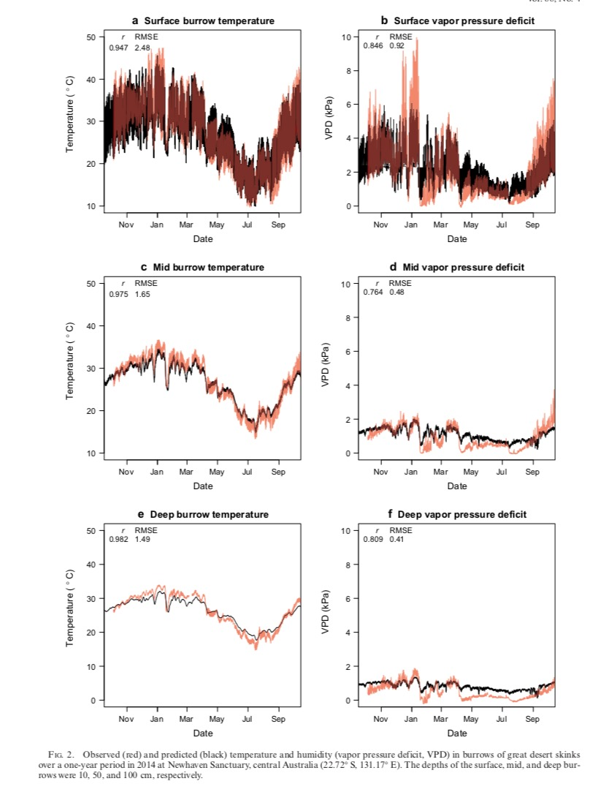
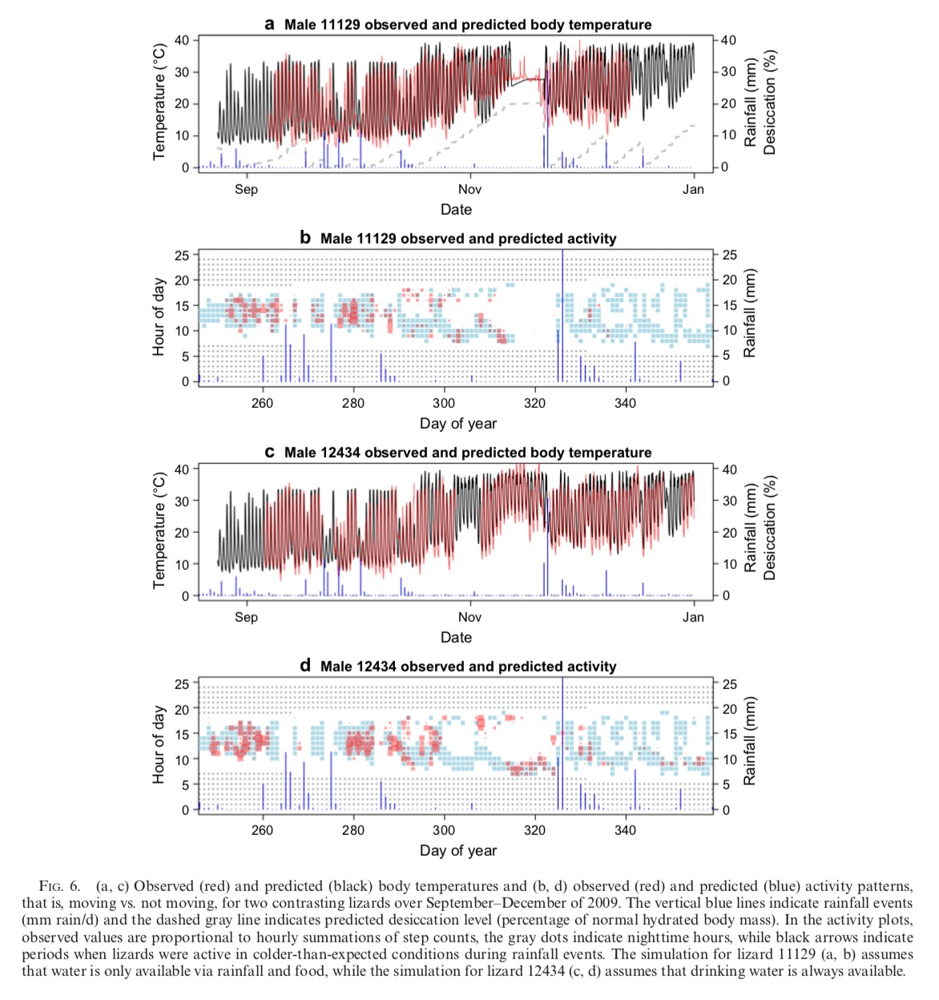
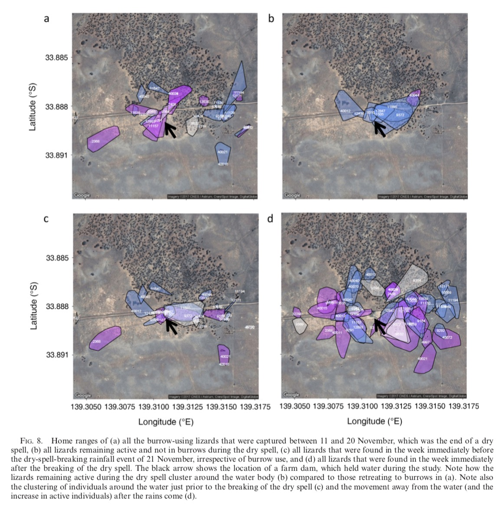
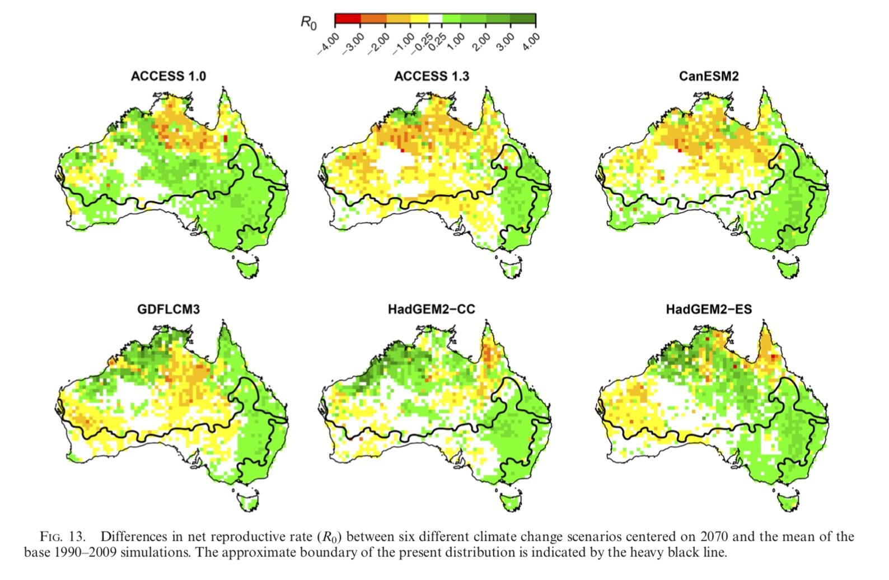

    

# Field tests of a general ectotherm niche model show how water can limit lizard activity and distribution    

### Michael R Kearney 1*, Suzanne L Munns 2, Danae Moore 3,4, Matthew Malishev 1,5 & C. Michael Bull 6    

##### _1School of BioSciences, The University of Melbourne, Parkville, Victoria 3010 Australia_    

##### _2College of Public Health, Medical and Veterinary Sciences, James Cook University, Townsville, Queensland 4810 Australia_  

##### _3Department of Biological Sciences, Macquarie University, North Ryde, New South Wales 2109 Australia_  
##### _4Australian Wildlife Conservancy, Newhaven Wildlife Sanctuary, P.M.B. 146, Alice Springs, Northern Territory 0872 Australia_ 

##### _5Centre of Excellence for Biosecurity Risk Analysis, School of BioSciences, The University of Melbourne, Parkville, Victoria 3010 Australia_  

##### _6School of Biological Sciences, Flinders University, Adelaide, South Australia 5001 Australia_  

##### *Corresponding author: Michael R Kearney    

Kearney MR, Munns SL, Moore D, Malishev M & Bull CM (2018) Field tests of a general ectotherm niche model show how water can limit lizard activity and distribution. _Ecological Monographs,_ 88(4): 672–693, [https://doi.org/10.1002/ecm.1326](https://esajournals.onlinelibrary.wiley.com/doi/abs/10.1002/ecm.1326).         
  
******

File extensions:   
.Rmd         
  
******  

## Abstract    

Mechanistic forecasts of how species will respond to climate change are highly desired but difficult to achieve. Because processes at different scales are explicit in such models, careful assessments of their predictive abilities can provide valuable insights that will be relevant to functionally similar species. However, there are surprisingly few comprehensive field tests of mechanistic niche models in the literature. We applied a general, thermodynamically grounded modeling framework to determine the fundamental niche of an extremely well-studied herbivorous ectotherm, the sleepy lizard _Tiliqua rugosa_. We then compared the model predictions with detailed long-term field observations that included sub-hourly data on microclimate, activity levels, home ranges, and body temperatures as well as annual to decadal patterns of body condition and growth. Body temperature predictions inferred from gridded climatic data were within 10% of empirically observed values and explained >70% of observed daytime activity patterns across all lizards. However, some periods of activity restriction were explained by predicted desiccation level rather than by temperature, and metabolically driven activity requirements were much lower than potential activity time. Decadal trajectories of field growth and body condition could also be explained to within 10% of observed values, with the variance in trajectories being attributable to whether individuals had access to permanent water. Continent-wide applications of the model partly captured the inland distribution limit, but only after accounting for water limitations. Predicted changes in habitat suitability under six climate change scenarios were generally positive within the species’ current range, but varied strongly with predicted rainfall. Temperature is regarded as the major factor that will restrict the distribution and abundance of lizards and other terrestrial ectotherms under climate change. Yet our findings show how water can be more important than temperature in constraining the activity, habitat requirements, and distribution limits of terrestrial ectotherms. Our results demonstrate the feasibility of first-principles computation of the climatic limits on terrestrial animals from gridded environmental data, providing a coherent picture for how species will respond to climate change at different scales of space and time.    

**Key words:** activity restriction, biophysical model, climate, ectotherm, energy budget, field-validation, mechanistic niche model, water budget.      

******    

## Outputs  

   
    
  
    
  
  
  
  
******      

## Maintainer      
**Matt Malishev**       
:mag: [Website](https://darwinanddavis.github.io/DataPortfolio/)          
:bird: [@darwinanddavis](https://twitter.com/darwinanddavis)      
:email: matthew.malishev [at] gmail.com          